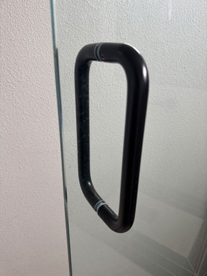

# Chapter 1 Self Reflection — **The Design of Everyday Things**

**The golden rule:** When people have trouble using something, it's almost always a design flaw — not a user error.

It's no joke that Chapter 1 of *The Design of Everyday Things* is a marathon read. This is my second or third time reading it, and every time I read it, it has genuinely shifted how I view everyday objects — doors, for example.

#### The Classic "Norman Door"

Sometimes, the design itself creates the confusion. Don Norman uses doors as a prime example (as compared to a complex jetliner cockpit) because we've all shared the same experience: pushing a door that was supposed to be pulled, or pulling one that was supposed to be pushed. It seems like a minor inconvenience, but it perfectly illustrates the importance of intuitive design. And yes, never blame the user!

Fig 1. Example of a confusing door 

Norman explains that 
> Two of the most important characteristics of good design are discoverability and understanding (Norman, 2013, p. 3). 

This stood out to me because a well-designed door should make it obvious what I am supposed to do without requiring trial and error.

#### Human-Centered Design in the Wild

One concept that really stood out to me was **Human-Centered Design (HCD)**. Good design should provide clear clues about what people are supposed to do, completely eliminating guesswork.

Norman describes HCD as 
> an approach that puts human needs, capabilities, and behavior first (Norman, 2013, p. 8). 

This made me think about how designers should consider the actual person using a product instead of assuming that everyone will understand it the way the designer intended.

I immediately related this to a **laptop backpack** I tried:

*   **The Problem:** When I first used it, I couldn't figure out where the laptop compartment was or how to access it. The zipper was completely hidden behind the back padding near the bottom.
*   **The Realization:** Initially, I blamed myself for not inspecting it closely before buying. Then, I realized this was an intentional case of *security by design*.
*   **The Outcome:** I ended up returning the product. It just didn't fit my usability needs, and I haven't bought anything like it since.

#### A New Perspective

This chapter made me realize how quickly I default to blaming myself when I can't figure something out. Moving forward, I will view these friction points as potential product design failures rather than immediately assuming that I am the problem.

Great design should make things effortless to understand, rather than forcing users to rely on instructions or trial and error. Ultimately, this reading changed the way I evaluate the objects around me. I now pay closer attention to small design choices, asking myself: *Is this designed well for humans to use, or does it require guesswork that will ultimately lose user buy-in?*

### References

Norman, D. A. (2013). *The design of everyday things: Revised and expanded edition*. Basic Books.

---

*Disclaimer: This blog is crafted by Ken Pao and features AI-corrected grammar and spelling, with some restructuring to enhance its visual presentation.*