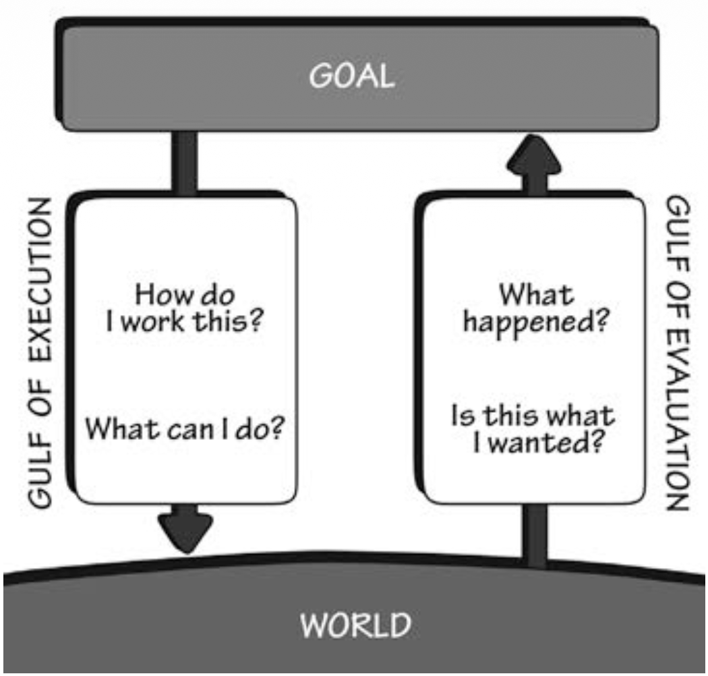
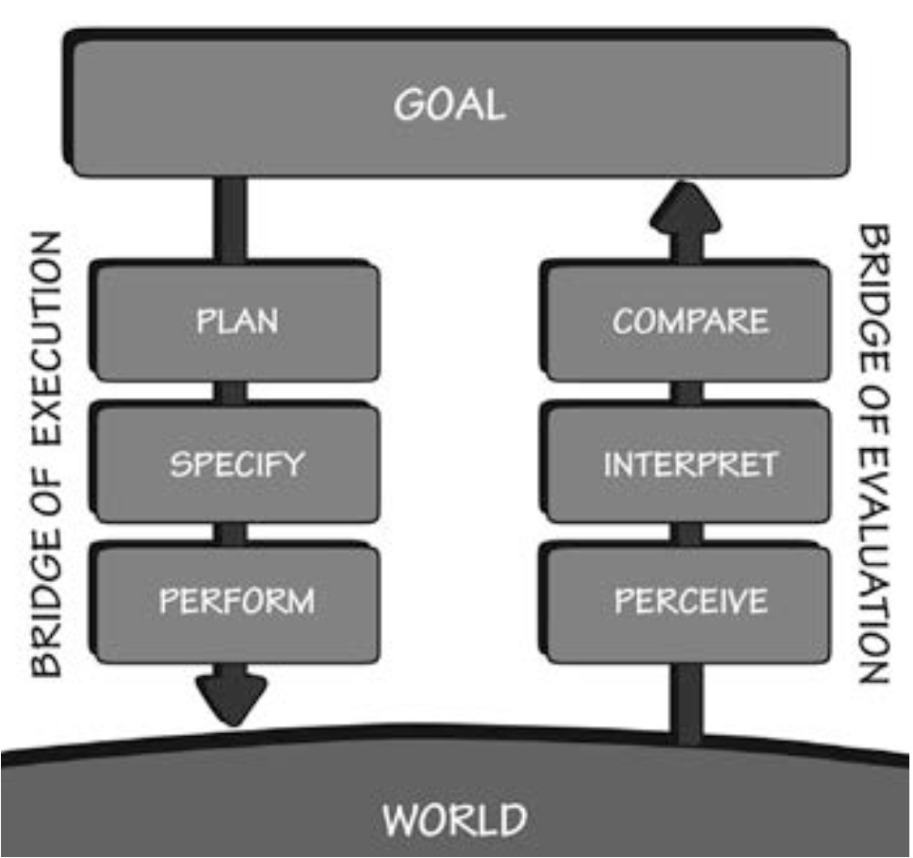

# Chapter 2 Self Reflection — **The Design of Everyday Things**

**Key point:** When an interface leaves someone confused or frustrated, the failure lies in the system's communication, not in the user's intelligence.

Chapter 2, "The Psychology of Everyday Actions," digs into what actually happens in our minds when we interact with things. If Chapter 1 was about recognizing poor design in the physical world, Chapter 2 is about understanding the psychological friction that happens right before we give up.

#### Bridging the Two Gulfs

Norman introduces two fundamental hurdles that every user faces: the Gulf of Execution (trying to figure out how something works) and the Gulf of Evaluation (trying to figure out what just happened). 

Norman states the designer's primary job around these gaps:
> "The role of the designer is to help people bridge the two gulfs." (Norman, 2013, p. 38)

Norman used his example of opening a filing cabinet to illustrate a failed design on an everyday product, how the visible elements of the filing cabinet applied to Gulf of Execution and how the failed opening actions with no signifiers implied to the Gulf of Evaluation. I especially like the simple figure 2.1 to present the relationship between the two gulfs.

#### The Seven Stages of Action and Root-Cause Thinking

To further explain how designers can bridge the two gulfs, Norman breaks human behavior down into the Seven Stages of Action: goal, plan, specify, perform, perceive, interpret, and compare.

Norman visually maps this process in figure 2.2.

What struck me most was how Norman used a goal of turning on a light to reverse-trace back to his ultimate goal of satisfying hunger, developing a hierarchy of five subgoals. And this is what he called - root cause analysis, keep asking "why" until the ultimate.

Kind of related to the landlady who blamed herself for not able to open the filing cabinet and tied back to chapter 1, Norman explains how people easily falsely blame themselves :
> "This false blame is especially ironic because the culprit here is usually the poor design of the technology, so blaming the environment (the technology) would be completely appropriate." (Norman, 2013, p. 63)

This directly leads to "learned helplessness," where people repeatedly blame themselves for poorly designed interactions and eventually conclude they simply aren't tech-savvy enough.

#### The Three Levels of Processing in the Wild

Norman details how cognition and emotion work across three levels: Visceral (immediate physical reaction), Behavioral (learned habits and routine skills), and Reflective (conscious analysis, memory, and assigning blame). 

I noticed this dynamic clearly when using a modern digital temperature-control kettle:

*   Visceral: The sleek matte finish, a clear glass pot, and bright digital display look high-end and inviting on the counter.
*   Behavioral: Muscle memory expects a quick push or simple switch to start boiling water immediately. Instead, the kettle requires turning the power on, selecting a temperature for a specific type of tea, and then pressing the start/stop button again.
*   Reflective: Because the small display gives sluggish feedback, I constantly second-guess whether it registered my input. When it failed to heat because I missed the second start button press, I blamed myself for "not paying attention"—until I realized the kettle provided virtually zero feedback bridging the Gulf of Evaluation. It just sits there with no signifier telling me what happened after I turned it on or set the temperature.

#### A New Perspective

This chapter reinforced that "human error" is almost always design error. When users make mistakes, it is usually because the system failed to provide clear feedforward before the action or adequate feedback afterward. 

Moving forward, I will evaluate design not just by whether an action is technically possible, but by how much cognitive effort is required to plan it, execute it, and confirm that it succeeded.

### References

Norman, D. A. (2013). *The design of everyday things: Revised and expanded edition*. Basic Books.

---

*Disclaimer: This journal is crafted by Ken Pao and features AI-corrected grammar and spelling, with some restructuring to enhance its visual presentation.*