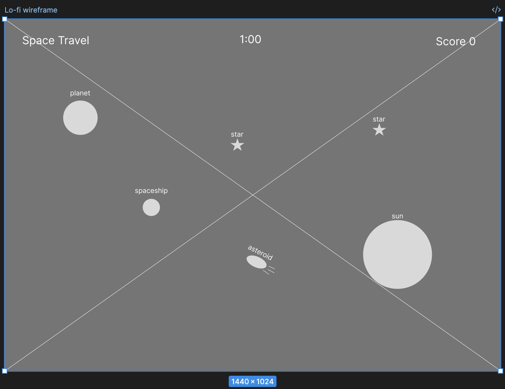
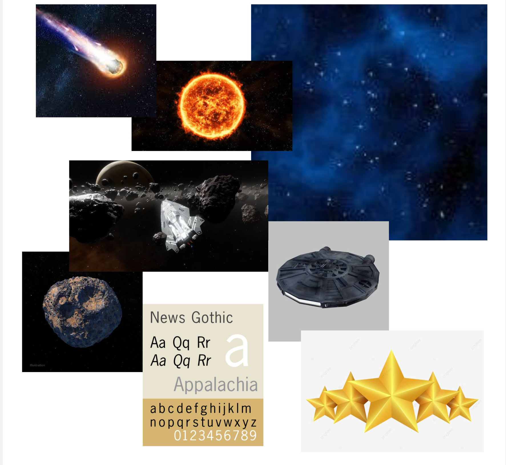

## Project 1

---

# Space Travel:

  [ <a href="https://kpao2020.github.io/MM-621/projects/p1/project1.html">Click Here to Play</a> ]

 

---

### Low Fidelity Wireframe

  

- 2D gameplay preferred on a full-desktop-screen browser, using a mouse to drive a spacespace in any direction. There are a few game objects for interactive and immersive gaming experience.

---

### Mood Board

    

- Dark themed space, futuristic spaceship style, growing stars, real planets, asteroids, and a big sun.

---

### Description:
Space Travel is a simple 2D game where the player controls a spaceship to collect stars, land on planets, while trying to avoid asteroids and the sun. 

The game uses p5.js for rendering graphics and Matter.js for physics simulation.
  - p5.js      = drawing, images, user interface, mouse input
  - Matter.js  = physics bodies, movement, and collision detection
  - Pythagorean Theorem is used to calculate distance between mouse position and spaceship which is then used to set spaceship's velocity
  - Array filter is used to update an array elements with condition
  - Spread syntax is used to flatten a nested arrays, which is very useful on function updateAsteroidBoundaries() and randomSafePosition()
  - Explosion animation is to enhance visual effect when something collided.
  - try to keep things simple and intend to NOT implement sound effects.

---

### Gameplay Design
- For the most immersive experience, I recommend playing in full-screen mode on a desktop browser.
- Players of all skill levels can immerse themselves in piloting a spaceship through a dark-themed space environment. 
- Players interact with randomly generated objects for fun, engaging, and challenging gameplay. As they progress, the difficulty increases proportionally.
- The game starts with a full health bar.
- Collecting stars or landing on planets earns points.
- Getting hit by an asteroid or crashing into the sun damages the spaceship's health.
- When the health bar is completely depleted, the game is over.

### Developer Notes
- The initial design relied on a one-minute timer to control the game loop. It featured a small spaceship with a fixed speed, no animations, no difficulty scaling, no health mechanics, and a single scoring system—which was barely enough for an MVP. 
- As development progressed and I received user feedback, I made the game more challenging. I implemented difficulty progression logic, enhanced the visual effects, and introduced more randomized elements. 
- To make the mechanics more reasonable, I replaced the one-minute timer with a health bar and swapped negative scoring for a health damage system.
- There were many bugs, which I hope I have now fully resolved. 
- Thanks to Professor Stannard's advice regarding an incorrect scoring bug, I split the function that originally handled both score calculation and the removal of collided objects into two separate functions. I also divided my single, lengthy sketch file into seven separate JavaScript files, making the codebase much easier to manage.

### Feature Roadmap
- Add more challenging objects.
- Add more animations for visual effects.
- Add sound effects.
- Adjust Game Title page to include more graphics, icons, instructions, login, high score history, and a "Cog" icon to allow customized settings, such as various spaceship choice, sound choice, background choice, difficulty choice, and more.
- Integrate with external social media to allow game feedback or exchange gaming experience.

---

### Note: 
  - This project is intended for educational purposes in the context of the MM-621 class project.

### Credits:
  - Adobe Stock Images for all images used in this game.

### References:
  - [P5.js Reference](https://p5js.org/reference/)
  - [Matter.js Docs](https://brm.io/matter-js/docs/)
  - [Coding Train Matter.js](https://www.youtube.com/watch?v=urR596FsU68)
  - [Matter Collision](https://stackoverflow.com/questions/45281577/matter-js-event-pairs-array-is-blank-on-collision)
  - [Pythagorean Theorem](https://gamedev.stackexchange.com/questions/60078/how-do-i-calculate-speed-given-x-y-components-of-a-velocity-vector)
  - [Array filter](https://www.youtube.com/watch?v=4_iT6EGkQfk)
  - [Spread syntax](https://developer.mozilla.org/en-US/docs/Web/JavaScript/Reference/Operators/Spread_syntax)
  - [Explosion animation](https://www.youtube.com/watch?v=YPKidHmretc&t=10s)

---